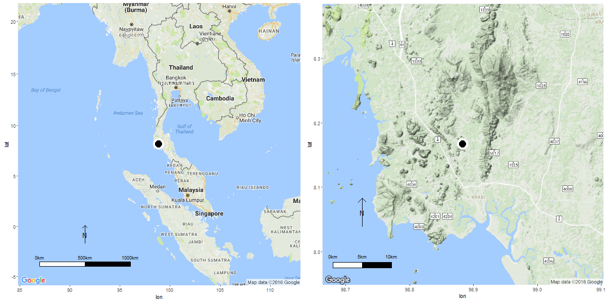
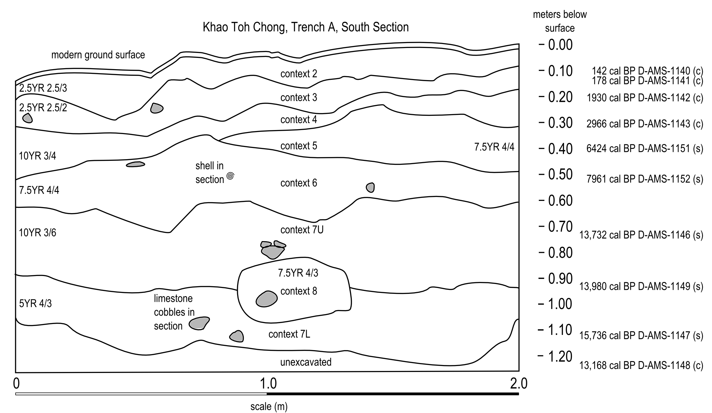
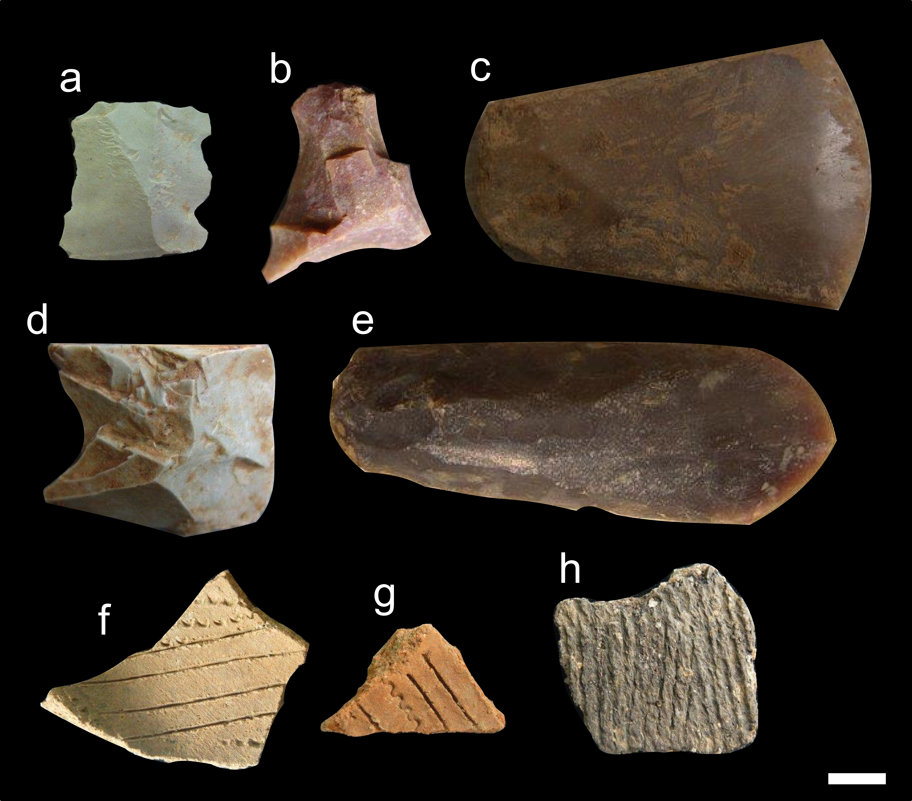

```{r setup, include=FALSE, cache = FALSE}
library(knitr)
opts_chunk$set(fig.path='../figures/',
              echo=FALSE, 
              warning=FALSE, 
              message=FALSE, 
              cache=TRUE,
              dpi=300)

library(dplyr)
library(ktc11)
```

## Introduction

An enduring dispute in Late Pleistocene and Holocene archaeology of mainland Southeast Asia is the nature of the transition from forager economies to agricultural economies (Higham et al. 2011, White and Bouasisengpaseuth 2008). As a key milestone in complex human-environment interactions, the debate has many dimensions. One view in this debate is the claim that agricultural technologies and cultures appeared in Southeast Asia as a result of influence from north Asia, via the lower Yangtze River and the Yellow River (Higham et al. 2011; Rispoli 2007). An alternative claim is that agriculture emerged from a locally contingent trajectory of changes in human-environment relationships (cf. Hunt and Rabett, 2014; White 1989). While the cultivation of rice and the domestication of pigs and cattle took place in the Yangtze Valley earlier than elsewhere in mainland SEA (Chi and Hung, 2010; Higham et al., 2011), the influence of local contingencies remains poorly understood. One of the enduring challenges is that a critical period of time for this transition -- the Late Pleistocene (c. 50-10 k BP, all dates quoted here are uncalibrated unless otherwise noted) through to the middle Holocene (c. 6–3.5 k BP, dates are uncalibrated unless stated)-- is sparsely represented in the archaeological record. We have a rich and well-documented record for the later Holocene when people were living more sedentary lifestyles, for example at Khok Phanom Di in Thailand and Man Bac in Vietnam (Oxenham et al. 2011). And we have many cave and rockshelter sites representing Pleistocene forager lifestyles, such as Tham Lod in Thailand and Xom Trai in Vietnam. 

However, during the middle Holocene, the archaeological record in mainland SEA is particularly sparse. This major gap in archaeological evidence for the region has been called 'the missing millennia' (White and Bouasisengpaseuth, 2008:39). It is an important period because major changes occurred during this time. Ceramics appeared in many parts of Southeast Asia; domesticated plants such as millet and rice appeared; stone artefact technologies transitioned from mostly flaked to mostly ground stone artefacts; settlements expanded from primarily karstic upland and estuarine landscapes during the early Holocene to include inland alluvial lowland villages by the late Holocene (White, 2011). But the current sparsity of the archaeological record means that questions of the timing and character of these changes remain difficult to answer.  

In this paper we present evidence of human activity from coastal Thailand that spans 'the missing millennia'. Khao Toh Chong rockshelter is significant because it has a rich faunal record spanning the middle Holocene, and is located in an area with a  detailed history of sea levels, relative to the region. This provides a unique opportunity to investigate locally contingent factors such as sea level changes on human subsistence behaviours at a critical time in the period of the transition from forager economies to agricultural economies. We report on a geoarchaeological analysis of the site to provide a local environmental context to the human occupation, as well as helping to understand site formation processes and artefact taphonomy. 

## Background

The Guangxi Province of southern China has extensive evidence of a forager economy with a semi-sedentary lifestyle during c. 7-4 k BP (Higham, 2013). Cave occupation continues until 6 k BC in Xianrendong and 5–4 k BC in Zengpiyan, and more than 30 open sites containing shell middens have been found on the terraces of the Zuojiang, Youjiang and Yongjiang rivers near Nanning, in southern Guangxi (Chi and Hung, 2012; Fu; 2002). Occupation of these sites, characterized by the largest, Dingsishan, spans 7000-3500 BC. The sites include pottery manufacturing workshops, cemeteries and large quantities of aquatic and terrestrial animal bones, indicating that fishing and hunting were important activities (no cultivars have been recovered). The archaeology of this region gives the impression of a continuous sequence of human occupation. We see gradual, overlapping adaptations resulting in changes in landscape use, the appearance of pottery and use of cemeteries, and at a much later date, an agricultural economy. The pottery and burial practices of the Dingsishan shell middens are identical to those found at the Da But sites of northern Vietnam, such as Da But, Con Co Ngua, Ban Ban Thuy, Lang Cong and Go Trung (Viet 2007). These sites were occupied by hunter-gatherer populations during 7.5–4 k BP (Viet 2007). Polished axes, pestles and mortars suggest cultivation, but clear evidence of food production only appears around 3.5-3.8 k BP at sites such as Man Bac with domesticated pig remains (Sawada et al., 2011). 

While this gives a picture of continuity between hunter-gatherers and agriculturalists in southern China and parts of northern Vietnam, elsewhere in mainland Southeast Asia continuity is harder to see. Hang Boi cave in inland northern Vietnam has a thick shell midden that spans just 10.6-12.3 k BP (Rabett et al., 2011). At sites in Thailand there is a gap between cave occupation and open site occupation. At Lang Rongrien rockshelter on peninsular Thailand, the most recent dated occupation is about 8 k BP, followed by undated and highly disturbed deposits containing burials and pottery (Anderson, 1990:20). Similarly, in northern Thailand rockshelter occupation at Tham Lod and Ban Rai becomes discontinuous at around 8 k BP (Marwick and Gagan, 2011; Shoocongdej, 2006). At Laang Spean rockshelter in Cambodia, the most recent occupation in 5 k BP, followed by later disturbance of the stratigraphy (Sophady et al. 2015; Forestier 2015).  The general pattern seems to be that cave and rockshelter sites switch from being occasional habitation sites to burial sites in the middle Holocene (Anderson 1997). A key challenge here is that the burials disturb the stratigraphy, making it difficult to assess continuity between forager occupation and later activity. There is also the possibility that open air sites were continuously occupied in the same way, but have been destroyed due to exposure to the weather. At extant open air sites, the record starts at around 4 k BP, for example at Khok Phanom Di (Higham and Thosarat, 2004) and  Nong Nor (Higham and Thosarat 1998), both near the Bang Pakong River, southeast of Bangkok, and at Ban Non Wat in the north east of Thailand (Higham and Kijngam, 2011). Occupation at these sites is characterized by burials, pottery, and in later phases, polished stone artefacts indicating crop cultivation. 

To investigate the gap in the archaeological record between the shift from rockshelters to open sites during the middle Holocene, we chose to focus on coastal karstic valleys of Krabi province. This landscape has been exposed to major changes as sea levels rose and fell during the Late Pleistocene and Early Holocene (Voris, 2000; Sinsakul, 1992). The most important sea level event for this region during this time is the mid-Holocene highstand. This highstand differs in timing and magnitude across the Indo-Pacific (Horton et al. 2005). The highstand has been documented in the Straits of Malacca (Streif, 1979; Geyh et al., 1979; Hesp et al., 1998), Phuket, Southwest Thailand (Scoffin and Le Tissier, 1998), and Malay Peninsula (Tjia, 1996; Kamaludin, 2001), with magitude up to +5 m in some locations. The highstand was the result of a combination of geoidal eustacy and hydro- and glacio-isostacy . This high stand event, combined with a low landscape such as in the Pang Nga region, makes the coastal karst of Krabi well-suited to assessing the effects of local environmental change on forager groups during a time of major transitions in subsistence. 

There are limited data available for reconstructions of Holocene sea levels in Southeast Asia. Sinsakul (1992) has summarised 56 radiocarbon dates of shell and peat from beach and tidal locations to estimate a Holocene sea level curve for peninsula Thailand that starts with a steady rise in sea level until about 6 k BP, reaching a height of +4 m amsl (above mean sea level). Sea levels then regressed until 4.7 k BP, then rising again to 2.5 m amsl at about 4 k BP. From 3.7 k to 2.7 k BP there was a regressive phase, with transgression starting again at 2700 BP to a maximum of 2 m amsl at 2.5 k BP.  Regression continued from that time until the present sea levels were reached at 1.5 BP. The evidence for these sea level changes comes from direct dating of marine shells and peat deposits at geological sites in peninsular Thailand (Sinsakul, 1992). Tjia (1996) collected over 130 radiocarbon ages from geological deposits of shell in abrasion platforms, sea-level notches and oyster beds and identified a +5 m highstand at ca. 5 k BP in the Thai Peninsula Malaysia.  Scoffin and Le Tissier (1998) dated 11 intertidal reef-flat corals (microatolls) to identify a +1 m high stand at about 6 k BP at Phuket, Southern Thailand. In their review of these data, Caution is required when inferring a single sea level curve for this region because the altitudinal range of the indicators is not completely known, their degree of precision is not uniformly known, and the number of data points are small (Horton et al. 2005; Woodroffe and Horton 2005). However, Sathiamurthy and Voris (2006) summarise the evidence described above as indicating that between 6 and 4.2 ka BP, the sea level rose from 0 m to +5 m along the Sunda Shelf, marking the regional the mid-Holocene highstand. Following this highstand, the sea level fell gradually and reached the modern level at about 1 k BP.

Previous research into archaeological correlates of these sea level changes in peninsula Thailand have been summarized by Anderson (2005). He describes faunal evidence from Lang Rongrien that has increases in marine shellfish around 7.5 k BP and between 4.0 k and 2.5 BP. Anderson proposes that the increases in marine shellfish at the site are probably related to increases in sea levels. A small number of other sites have been previously investigated in several provinces of peninsula Thailand. For example, Moh Khiew in Krabi with human remains at 25 k BP (Auetrakulvit et al., 2012, Chitkament, 2007; Matsumara and Pookajorn, 2005;  Pookajorn, 1994), Tham Khao Khi Chan in Surat Thani Province has occupation layers dating from 6.06 k BP to 4.25 BP (Srisuchat and Srisuchat, 1992). Buang Bap, also in Surat Thani, has faunal remains including marine shellfish dating between 6 k and 5 k BP (Srisuchat and Srisuchat, 1992). Pak Om has a dense and diverse archaeological deposit, but its two dates of 9.35 k and 3.01 k BP come from the same layer, so the chronology is uncertain (Srisuchat, 1997). Khao Tau in Pang Nga is a site complex with deep stratification and abundant cultural materials dating to 4.75 k and 5.25 k BP (Srisuchat and Srisuchat, 1992), Finally, there is the Tham Sua shell midden in Krabi that is a deposit of marine shell greater than one meter deep and with a basal date of 6.44 k BP (Anderson, 2005). 

These previous excavations demonstrate human occupation at several sites in peninsular Thailand during the critical time of sea level changes in the Holocene. However, the level of available detail does not give a clear picture of stratigraphic integrity or the subsistence strategies represented at the sites. The goal of our work at Khao Toh Chong was to build on this previous work, not only by collecting an assemblage spanning the Holocene, but also by conducting geoarchaeological analyses at the site to assess stratigraphic integrity and provide local environmental context to the human occupation. 

```{r locationmapmaker, include=FALSE, results = 'hide'}
# get the regional and closup map
my_maps()
```


```{r locationmap, fig.cap="Maps of the region and local area of the Khao Toh Chong rockshelter. The majority of the landscape between the site and the coast is <30 m above the current sea level."}
# get the regional and closup map

```

## Methods

### Excavation methods

In June-July 2011 we excavated two areas of 2x2 m to a depth of 1.6 m below the surface at Khao Toh Chong rockshelter (Figure \@ref(fig:locationmap)). Our review of previous work in the region indicated that stragraphic units often exceed 0.2 m, so we used semi-arbitrary excavated units of 0.05 m to subdivide the stratigraphic units and improve the spatial and chronological control of our finds. Our excavation units are semi-arbitrary because if we encountered a change in the deposit or the archaeology in the middle of an arbirary excavation unit (ie before it was 0.05 m deep), then we stopped digging that unit immediately and began another unit to ensure that we captured the change in conditions as accurately as possible. After the excavation was complete, we grouped excavated units with similar depositional qualities were grouped contexts for comparison and analysis of the archaeological and geoarchaeological data (this process is described in detail in Van Vlack 2014). Careful observations were made for traces of disturbance that might have mixed archaeological materials from different time periods. Excavated sediments were sieved using 5 mm and 10 mm screens. The site is a limestone overhang at the base of a 300 m high karst tower in Thap Prik Village. The rockshelter is about 30 m long with an average of about 10 m from the rear wall to the dripline. The dripline is about 40 m above the ground and a series of large boulders (3-4 m high) at the dripline give some protection from the wind and rain as well as trapping sediment in the shelter. The surface of the rockshelter is level fine sediment with no signs of disturbance and about 10 m above the surrounding ground, which is about 60 m above sea level. 

In Trench A, the southernmost trench, excavations reached a depth of 1.3 meters below the surface. In trench B, excavations were obstructed by bedrock in the northwest and southwest quadrants Subsequently, excavation depths in trench B extended to approximately 2.0 meters in the northeast and southeast parts of the trench. Charcoal and shells were collected from hearths encountered during excavation for radiocarbon dating. Charcoal and shell samples were dated using AMS methods by the Direct AMS laboratory in Seattle, WA, USA. Radiocarbon ages were calibrated to 95% ranges using Bchron 4.1.1 with the IntCal13 curve (Haslett and Parnell, 2008; Parnell et al., 2008; Reimer et al. 2011). Our archaeological and faunal analysis reported here is based on data from the southwest quadrant of trench A. All excavated materials are stored at the Faculty of Archaeology at the University of Silpakorn, Bangkok.  

### Geoarchaeological methods 

To investigate changes in the environment of deposition that might assist in interpreting the archaeological record, we analysed several physical and chemical attributes of the sediment in the archaeological deposit. Changes in particle size distributions, pH, electrical conductivity (EC), Soil organic material (SOM), calcium carbonate content, Magnetic susceptibility, XRD and ICP-AES can indicate changes in the sources of sediments accumulating at the sites, and the mechanisms of accumulation. Carbon isotopes, pollen and phytoliths can indicate how vegetation has changed at the site location. Taken together, these physical and chemical attributes can help reveal change or stasis in environmental conditions during the time of human occupation at the site that may help us understand the relationship between human behaviour and the mid-Holocene high stand event. 

Bulk sediment samples collected from a column taken from the south wall of excavation trench A. A 1 g sub-sample was dried at 60°C for 24 hours for particle size analysis. The sub-sample was sieved to remove the >2 mm particles and carbonates were removed by washing the sample in 20 ml of 1 M HCl. Samples were then centrifuged and treated with 30 ml of 30% H~2~O~2~ for an hour to remove organics (Scott-Jackson and Walkington, 2005). Additional drying occurred for 30 hours in a 60°C oven. Each sample was added to a mixture of deionized water and surfactant Triton X 10 and agitated before being run in a Horiba LA-950 at the University of Washington Materials Science Department. A quartz refraction index of 1.458 was used during analysis and the R package G2Sd v2.1.5 was used to compute summary statistics (Fournier et al., 2014).  

We measured pH and EC using a portable Oakton Waterproof Dual Parameter PCSTestr 35 on subsamples with a 1:1 ratio of sediment to deionized water. Soil organic material (SOM) and calcium carbonate content were measured by the Loss on Ignition method (after Gale and Hoare, 1991), as the percent of mass lost after heating samples to 600ºC for 4 hours and 1000ºC for 2 hours. Magnetic susceptibility was measured using a Bartington MS2 Magnetic Susceptibility Meter with 10 cm^3^ of sediment analyzed in sample pots at low and high frequency following Dearing (1999). Three replicates for each sample measurement of low and high frequency susceptibility were taken following Gale and Hoare (1991). 

Samples for organic Carbon isotope analysis consisted of a 2 g sub-sample dried at 60°C for 24 hours, sieved to remove the >2mm particle size fraction (Hartman, 2011), with organics were picked out and discarded before samples were ground for 5 minutes using a mortar and pestle. To remove mineral carbonates the samples were placed in 60 mL of 1 M HCl for 24 hours, stirring every 10 hours (Millwood and Boutton, 1998). The HCl was rinsed off three cycles of adding 60 mL of deionized water was stirred into the samples for 1 minute and then drying at 60°C for 48 h. Isotope measurements were conducted using a Costech Elemental Analyzer, Conflo III, MAT253 at the UW Earth and Space Sciences IsoLab.

For XRD analysis, samples were scanned on a Bruker D8 Focus X-Ray Diffractometer with a Cu radiation source. Following McGrath et al. (2008) we sub-sampled 2 g of >2 mm sediment and ground it to a fine powder. Next 20 ml of 30% H~2~O~2~ was used to remove organic matter. After effervescence it was removed and dried for another 60°C for 24 hours. After a final grinding, samples were scanned on a Bruker D8 Focus X-ray Diffractometer from 5° to 75° 2θ with a Cu radiation source at resolution 0.02° steps per second with 40 kV and 40 mA power output. MDI Jade 9 software was used to identify minerals. 

For compositional analysis by ICP-AES a 1 g sub-sample was added to 10ml of HNO~3~ and heated at 90°C for 15 minutes (Misarti et al., 2011). Another 5ml of HNO~3~ was next added and heated at 90°C for 60 minutes. Next, deionized water and 30% H~2~O~2~ were added and 10ml HCl was added and heated. The samples were diluted with deionized water and filtered before ICP-AES analysis. This acid digest provides a broad spectrum of elements in a known volumetric concentration, suitable for ICP-AES analysis (Balcerzak, 2002; Carter, 1993). The samples were analyzed in a Perkin Elmer Optima 8300DV in the University of Washington Chemistry Department.

We were unable to extract quantifiable amounts of pollen or phytoliths from the sediment samples (further details are reported in Van Vlack, 2014). This is likely due to the frequent wetting and drying of the rockshelter deposit which creates poor conditions for microflora preservation. 

### Zooarchaeological methods

Methods for zooarchaeological analysis of the faunal remains from A-SW of KTC are reported in Conrad et al. (2013) and Van Vlack (2014). To summarise, we conducted faunal identification using comparative collections at the National Science Museum, Natural History Museum, National Science Museum, of Thailand. Comparative and reference literature included Auetrakulvit (2004), Brandt (1974), and Lekagul and McNeely (1977). Quantification of the assemblage followed Lyman (2008) for taxonomic abundance. Shannon’s index analysis was modeled after Magurran (2004), and Pielou’s index was modeled after McCune et al. (2002).


```{r sitesection, fig.cap="South section of Khao Toh Chong rockshelter trench A. The radiocarbon ages are the midpoints of the 95% calibrated age intervals. (c) indicates charcoal and (s) indicates shell as the material dated."}

```


```{r sitemap, fig.cap="Plan of Khao Toh Chong rockshelter. The top image shows a view looking North, with trench A in the foreground. The middle image shows the South section of trench B. The bottom image shows the South section of trench A"}
knitr::include_graphics("../figures/maps/ktc11_site_map.png")
```


## Results

They key findings from the field observations of our excavations were a faunal assemblage in a deposit with relatively few macroscopic traces of post-depositional disturbance (Figure \@ref(fig:sitemap)). We did not encounter any burials or animal burrows and there is very limited termite activity in the deposit. We did not reach bedrock due to time constraints. 

All excavated materials are currently stored at the Silpakorn University Faculty of Archaeology's Phetchaburi campus. The raw data and code used to generate the results presented here have been organised into research compendium following the structure of an R package (Wickham, 2015) to enable reproducibility of the results (Marwick 2016). This compendium is archived online at https://dx.doi.org/10.6084/m9.figshare.2065602.v1  


```{r read_in_the_data, cache = FALSE}
library(ktc11)
the_data <- read_in_the_data()
# While the data was collected we stored it here: https://catalyst.uw.edu/gopost/conversation/bmarwick/628803/post/2229534#2229534 and https://docs.google.com/spreadsheets/d/1_a20envyJUBA69NfSyLu0JniVUxnyKzAePUwQFrkS64/edit?pref=2&pli=1#gid=0
```


```{r tableofcalibrateddates}
# get table of calibrated dates
calibrated_dates <-  calibrate_the_dates(the_data$ktc11_radiocarbon_dates)

# show the table
kable(calibrated_dates$dates_table[, -ncol(calibrated_dates$dates_table) ], 
      row.names = NA,
      caption = "Summary of radiocarbon dates from Khao Toh Chong")
```


```{r plotofcalibrateddates, fig.cap="Depth-age plot of calibrated radiocarbon dates from Khao Toh Chong"}
# show the plot
library(scales)
library(ggplot2)
ggplot(calibrated_dates$dates_table, aes(midpoint, `Depth below surface (m)`, group = `Material dated`)) +
  geom_point(aes(shape = `Material dated`), size = 5) +
  geom_smooth(method = "lm", se = FALSE) +
  xlab("calibrated years BP") +
  scale_y_reverse() + 
  theme_bw() + 
  theme(legend.position = "bottom") + 
  theme(axis.text = element_text(size = 14)) +
  scale_x_continuous(labels = comma)
```


```{r agedepthmodel, results = 'hide'}
# compute age-depth model
library(Bchron)
c14_ages <- the_data$ktc11_radiocarbon_dates
c14_ages <- c14_ages[c14_ages$Material == "charcoal", ]

Out  =  Bchronology(ages = c14_ages$RCAge,
                  ageSds = c14_ages$RCAge_1s_error,
                  calCurves = c(rep('intcal13', nrow(c14_ages))),
                  positions = c14_ages$depth_below_surface *100,
                  positionThicknesses = 10,
                  ids = c14_ages$Sample_Name)

predictAges = predict(Out, newPositions = c(160))
lowest_age <- round(unname(quantile(predictAges)[3])/1000, 1)
```

```{r agemodelplot, fig.cap="Depth-age model of calibrated radiocarbon dates on charcoal from Khao Toh Chong. The grey shaded area indicates the 95% confidence interval of the age at a given depth, computed by a non-parametric chronology model fitted to age/deoth data according to the Compound Poisson-Gamma model of Haslett and Parnell (2008). The black areas show the distribution of the calibrated ages."}
# draw plot of model
plot(Out, 
     main = "", 
     xlab = "Age (cal BP)", 
     ylab = "Depth below surface (cm)", 
     dateHeight = 10)

```

```{r mean_difference_offset, results='hide', cache = TRUE}
# compute mean difference in offset (rather slow)
mean_difference_offset_output <- mean_difference_offset(the_data$ktc11_radiocarbon_dates)
mean_difference_offset_value <- round(mean_difference_offset_output$mean_difference,0)
```

### Chronology

Five charcoal samples and five shell samples returned radiocarbon age determinations (Table \@ref(tab:tableofcalibrateddates)). The shell's ages are offset from the charcoal ages by an average of `r mean_difference_offset_value` years, indicating a substantial reservoir effect. Considering only the charcoal dates, the excavated deposit spans from before 13.5 k cal. BP through to about 0.15 k cal. BP (Figure \@ref(fig:agemodelplot)).

The depth-age relationship for the dated samples is strongly linear, suggesting a constant rate of sediment accumulation (Figure \@ref(fig:plotofcalibrateddates)). Although there is nearly a meter between the lowest and second lowest charcoal samples, the linear tendency of the shell samples that span this gap suggest that the accumulation of sediment at the site has been constant through the Holocene. Using the ages of the charcoal samples, we computed a non-parametric chronology model to estimate the approximate ages of undated excavation units. Using this model, we estimate the date of the lowest excavation level to be approximately `r lowest_age` k cal. BP. 


```{r sedimentsstratplot, results = 'hide', fig.show = 'hide'}

# join with carbon isotope data
geoarch_summary_data <- join_carbon_to_summary(the_data$ktc11_d13C_data, the_data$ktc11_summary_geoarch_data)

range_carbon_istope_data <- round(range(geoarch_summary_data[,ncol(geoarch_summary_data)]),2)

# compute summary particle size data from raw data
particle_size_data_summary <-  particle_size_data_summary(the_data$ktc11_particle_size_data)

# join with summary geoarch data
sediments_strat_plot <- cbind(geoarch_summary_data, particle_size_data_summary$particle_size_data_summary_subset)

sediments_strat_plot$`%fd` <- 
 abs(sediments_strat_plot$`%fd`) 

# make column names informative
names(sediments_strat_plot) <- c("Sample ID", "Depth (m)", "pH", "Conductivity \n(mS)", "Soil organic \nmatter (% mass)", "Carbonates \n(% mass)", "Magnetic \nsusceptibility", "Frequency \ndependency (%)", "\u03B413C \u2030 VPDB", "Mean particle \nsize (\u00B5m)", "sd particle size \n(\u00B5m)")

library(analogue)
invisible(
the_plot <- Stratiplot(sediments_strat_plot[,c(-1, -2)], 
           y = sediments_strat_plot$`Depth (m)`, 
           rev = TRUE, 
           varTypes = "absolute",
           type = c("h","l"),
           ylab = "Depth below surface (m)",
           col = "black",
           lwd = 0.5,
           lwd.h = 0.5,
           labelRot = 90))

```

```{r geoarchcorrtable}
# compute correlations
corrs <- long_corr_matrix(sediments_strat_plot[,c(-1)])
interesting_corrs <- corrs %>% filter((cor > 0.6 | cor < -0.6) & p < 0.05)
corr_mag_sus_and_som <- interesting_corrs[2, ]

for_corr_table <- as.matrix(sediments_strat_plot[,-c(1:2)])
# table of correlations
geoarch_corr_for_table <- Hmisc::rcorr(for_corr_table)

geoarch_two_tables_into_one <- 
  as.data.frame(do.call(cbind, lapply(1:ncol(geoarch_corr_for_table$r), 
  function(i) paste0(
       ifelse(
             (as.numeric(geoarch_corr_for_table$r[ , i]) > 0.7 |
              as.numeric(geoarch_corr_for_table$r[ , i]) < -0.7) & 
              as.numeric(geoarch_corr_for_table$P[ , i])  < 0.05,
              paste0("**", round(geoarch_corr_for_table$r[ , i], 2)),
              round(geoarch_corr_for_table$r[ , i], 2)
              ),
       ifelse(
             (as.numeric(geoarch_corr_for_table$r[ , i]) > 0.7 |
              as.numeric(geoarch_corr_for_table$r[ , i]) < -0.7) & 
              as.numeric(geoarch_corr_for_table$P[ , i])  < 0.05,
              paste0(" (", round(geoarch_corr_for_table$P[ , i], 2), ")**"),
              paste0(" (", round(geoarch_corr_for_table$P[ , i], 2),")")
              )
  ))))
       

names(geoarch_two_tables_into_one) <- c("pH", "EC", "SOM", "CaCO3", "Xlf", "fd", "d13C", "mean_size", "sd_size")

# get lower diag only 
lower <- as.matrix(geoarch_two_tables_into_one)
lower[lower.tri(geoarch_two_tables_into_one, diag=TRUE)] <- ""
lower <- as.data.frame(lower)
row.names(lower) <- names(geoarch_two_tables_into_one)
kable(lower, row.names = TRUE,
      caption = "Correlations of geoarchaeological variablesat KTC. Cell values are Pearson's product-moment correlation coefficient and values in parentheses are p-values. Strong significant correlations are in bold.")
```


```{r stratiplot, fig.cap="Summary of bulk sediment analysis of samples from Khao Toh Chong. Magnetic susceptibility is reported as low frequency mass specific units 10^8^ m^3^ kg^-1^"}
# draw stratigraphic plot

# manually change the limits of the panels
# this auto updates ticks and labels
the_plot$x.limits[[1]] <- c(6,11) 
the_plot$x.limits[[3]] <- c(0,20) 
the_plot$x.limits[[4]] <- c(0,30)
the_plot$x.limits[[6]] <- c(0,20)
the_plot$x.limits[[8]] <- c(0,500)
the_plot$x.limits[[9]] <- c(0,500)
the_plot$x.scales$rot <-c(90,90)
the_plot$x.scales$cex <- c(0.5, 0.5)
the_plot$y.scales$cex <- c(0.5, 0.5)

# draw the plot
the_plot

```


### Geoarchaeology

Analysis of sediments collected from the 2011 Khao Toh Chong excavations show a relatively constant depositional environment. The deposit is mostly sandy silt with occasional additions of coarser sands and gravels (for example in context A-4, 0.3 m below surface). Slight fluctuations in particle size distribution and carbonate percentage likely reflect minor variations in contributions from alluvial, fluvial and colluvial inputs (including limestone eroding from the karst tower) (Gale and Hoare 1991). Overall, the picture is of relatively constant and uninterrupted deposition. 

#### Chemical analyses and magnetic susceptibility

The results of the chemical, magnetic susceptibility and particle size analyses are depicted in Figure \@ref(fig:stratiplot). pH values at KTC are strongly alkaline throughout, with a shift occurring from pH 9.1 to 7.6 between contexts A-5 and A-6 (0.4-0.53 m below surface). Electrical conductivity (as a proxy for soluble minerals) and soil organic matter decline sharply below the surface, probably due to natural decay of organics. Soil carbonates are steady between 8% and 12% throughout, reflecting a continuous contribution from the limestone rock of the shelter. Low frequency magnetic susceptibility peaks in context A-5 (0.40 m below surface), indicating an enrichment of magnetic minerals in the deposit. This context also has the highest proportion of carbonates (12%), which would reduce magnetic susceptibility, so the change in A-5 is not a simple dilution of magnetic minerals by diamagnetic minerals. 

#### Carbon isotope analysis

The δ^13^C values at KTC range between `r range_carbon_istope_data[1]` and `r range_carbon_istope_data[2]`, with values becoming increasingly negative in more recent times (Figure \@ref(fig:stratiplot)).  The tissues of C3 plants have δ^13^C values ranging from −20‰ to −32‰, while those of C4 plants range from −9‰ to −17‰ (Deines, 1980). This indicates an overall dominance of C3 plants, suggestive of forested-grassland vegetation, including evergreen trees and shrubs, surrounding the site (DeNiro, 1987; Yoneyama et al., 2010).

```{r summaryxrddata}
# show the table
ktc11_summary_xrd_data <- the_data$ktc11_summary_xrd_data
kable(ktc11_summary_xrd_data, caption = "Summary of X-ray diffraction data from Khao Toh Chong. Units are percent mass.")
```

#### X-ray Diffraction

The XRD analysis showed quartz and calcite present in all samples, indicating a similar source of sediments throughout the depositional history of the site. Kaolinite was identified in samples from A-2, A-3, and A-6, suggesting a greater contribution of more intensely weathered sediment during the formation of those deposits (Alam et al., 2008). An alternative possibility is that the Kaolinite derives from ceramics found in those contexts. The proportions of Calcite in each sample support the loss on ignition results for carbonates, showing low variation throughout the sequence. Small amounts of Periclase were observed, indicating metamorphosis of the local limestone. 

```{r icpaesdatasummary}
icp_aes_data <- icp_aes_data_summary(the_data$ktc11_raw_ICP_data)
# table of elements
kable(round(icp_aes_data,2),
      caption = "Elemental concentration by ICP-AES, all measurements are in ppm")
```


```{r correlements}
# correlation matrix of elements of interest
icp_corr_for_table <- Hmisc::rcorr(as.matrix(icp_aes_data))

icp_two_tables_into_one <- 
  as.data.frame(do.call(cbind, lapply(1:ncol(icp_corr_for_table$r), 
  function(i) paste0(
       ifelse(
             (as.numeric(icp_corr_for_table$r[ , i]) > 0.7 |
              as.numeric(icp_corr_for_table$r[ , i]) < -0.7) & 
              as.numeric(icp_corr_for_table$P[ , i])  < 0.05,
              paste0("**", round(icp_corr_for_table$r[ , i], 2)),
              round(icp_corr_for_table$r[ , i], 2)
              ),
       ifelse(
             (as.numeric(icp_corr_for_table$r[ , i]) > 0.7 |
              as.numeric(icp_corr_for_table$r[ , i]) < -0.7) & 
              as.numeric(icp_corr_for_table$P[ , i])  < 0.05,
              paste0(" (", round(icp_corr_for_table$P[ , i], 2), ")**"),
              paste0(" (", round(icp_corr_for_table$P[ , i], 2),")")
              )
  ))))

names(icp_two_tables_into_one) <- names(icp_aes_data)

# get lower diag only 
lower <- as.matrix(icp_two_tables_into_one)
lower[lower.tri(icp_two_tables_into_one, diag=TRUE)] <- ""
lower <- as.data.frame(lower)
row.names(lower) <- names(icp_two_tables_into_one)
kable(lower, row.names = TRUE,
      caption="Correlation matrix of elements analysed by ICP-AES. Cell values are Pearson's product-moment correlation coefficient and values in parentheses are p-values. Strong significant correlations are in bold.")
```

```{r denroelements, fig.cap="Dendrogram of samples based on hierarchical cluster analysis of ICP-AES results"}
# cluster analysis of contexts using elemental data
d <- dist(icp_aes_data, method = "euclidean") # distance matrix
# Then do the cluster analysis and plot dendrogram
plot(as.dendrogram(hclust(d, method="ward.D2")))
```


#### Inductively coupled plasma-atomic emission spectrometry 

Results from ICP-AES analyses are presented in Table \@ref(tab:icpaesdatasummary), with the concentrations of elements of interest to geogenic and anthropogenic sources including Si, Ca, Sr, Mn, Fe, Zn, Na, K, Mg, and Ti (Araujo et al. 2008; Arroyo-Kalin et al. 2009; Cook, 1965, Costa and Kern, 1999, Eidt, 1985, Knudson et al., 2004, Middleton, 2004, Middleton and Price, 1996, Woods, 1984 and Woods and Glaser, 2004). The majority of these elements are strongly positively correlated (Table \@ref(tab:correlements)), and there are no significant negative correlations. 

```{r artefactphoto, fig.cap="Examples of ceramics, ground and flaked stone artefacts from Khao Toh Chong.  a) chert flake (EU19), b) quartzite flake (EU18), c) quartzite polished adze (EU5), d) chert flake (EU18), e) quartzite polished adze (EU5), f & g) ceramic sherd with incised and infilled decoration (EU3), h) cord-marked ceramic (EU4)"}


```

```{r tableoflithicsandceramics}
ktc11_summary_ceramics_lithics <- table_ceramics_lithics(the_data$ktc11_lithic_data, the_data$ktc11_ceramic_data)
# show the table here
kable(ktc11_summary_ceramics_lithics, caption = "Summary of ceramics and stone artefacts recovered from Khao Toh Chong.")

# are the archaeological data correlated with the geo data?
# combine datasets
all_data <- cbind(ktc11_summary_ceramics_lithics, ktc11_summary_xrd_data, icp_aes_data)
# remove character cols
all_data$Context <-  NULL
all_data$Context <-  NULL
# inspect for significant correlations
all_data_corr <- long_corr_matrix(all_data)
significant_correlations <- all_data_corr[all_data_corr$cor > 0.7 | all_data_corr$cor < -0.7 & all_data_corr$p < 0.05, ]
```

```{r artefactsplot, fig.cap="Distribution of ceramics and stone artefacts in each excavation unit over time at Khao Toh Chong. Ages older than 13,000 cal BP have been extrapolated using the age-depth model described above."}
# plot ceramic and stone artefact mass together, by age
plot_ceramic_and_stone_artefact_mass(the_data, calibrated_dates)
```


### Archaeology

The archaeological materials consist mostly of small broken pieces of ceramic and flaked stone artefacts (Table \@ref(tab:tableoflithicsandceramics), Figure \@ref(fig:artefactphoto), Figure \@ref(fig:artefactsplot)). The stone flakes are relatively small, unretouched and typically have little to no dorsal cortex. There are no unambiguous signs of Hoabinhian technology, such as unifacially flaked flat ovoid cobbles, or flakes that might have been removed from these cobbles. Two complete polished adzes were found in the upper layers, and several flakes with traces of abrasion on the platforms were also found, indicating adze manufacturing. Ceramic decorations at KTC are typical for the region, including cord-marked and parallel incised and infilled lines (Rispoli 2007; Anderson 1990; Pookajorn 1994). There are no significant correlations between the artefact counts and masses and any of the geoarchaeological variables. Artefacts were found in every excavation unit, but we suspect that ceramics in the lower part of the deposit may be post-depositional intrusions resulting from the activity of treeroots and termites. Disturbance is not a significant factor at KTC. However, episodes of seasonal wetting and drying may have contributed to small amounts of vertical displacement of the heavier ceramic sherds. We know that these wetting and drying episodes occurred due to the lack of preservation for fossil pollen. The mineralogical and sediment particle size data also support this interpretation of minimal disturbance. Radiocarbon dating of residues on ceramics at Spirit Cave obtained much younger dates (c. 3 k BP) than the stratigraphically associated charcoal samples (c. 7.6 k BP) (Lampert et al., 2003). This shows that there is probably some mixing in the stratigraphic layers at Spirit Cave. Comparatively, the KTC ceramics may have also shifted vertically over time due to the episodes of regional increases in precipitation from either the water table or seasonal monsoonal storms. Future work on thermoluminescence dating of KTC ceramics may be useful to investigate this possibility.   

The archaeological sequence at KTC shows signs of change over time, similar to the geoarchaeological sequence described above, indicating that any distubrance that might have occured has not been so extensive as to completely erase time-ordering of artefacts in the deposit. The stone artefact technology changes from to large flaked cores and flakes made from coarse-grain metamorphic rock in the lower levels to polished adze flakes made from finer-grained rock in the upper levels. The ceramic assemblage also changes from thick, red sherds with frequent incised decorations in the lower levels to predominantly black sherds in the upper levels. However, the small number of artefacts in the deposit overall limits the degree to which we can distinguish these changes as part of a major regional trend or idiosyncratic use of this site. 


```{r faunaltable}
# Mammals, reptiles, etc.
fauna_and_molluscs_table <- table_fauna_and_molluscs(the_data)
# show the tables 
kable(fauna_and_molluscs_table$bones_NISP_MNI_total, 
      caption="NISP of mammal, reptile and fish remains recovered from Khao Toh Chong (MNI values in parentheses, columns are depositional contexts formed by grouping consecutive spits with similar qualities).")
```

```{r shelltable}
kable(fauna_and_molluscs_table$shells_NISP_MNI_total,
      caption = "NISP of mollusk remains recovered from Khao Toh Chong (MNI values in parentheses).")
```

```{r mnilognisp}
mni_log_nisp_output <- mni_log_nisp(fauna_and_molluscs_table)
r_value <- round(mni_log_nisp_output$corr_output$estimate, 3)
df <- mni_log_nisp_output$corr_output$parameter
p_value <- round(mni_log_nisp_output$corr_output$p.value, 3)

# ecological indices
ecological_indices_table <- ecological_indices(fauna_and_molluscs_table)
kable(ecological_indices_table,
      caption = "Ecological indices of diversity and evenness for the faunal assemblage recovered from Khao Toh Chong. Pielou's index is also known as the Shannon index of evenness")
```


### Faunal assemblage

Mammalian abundance and distribution at the rockshelter throughout the late-Pleistocene and Holocene describes a diverse array of taxa in the deposits (Table \@ref(tab:faunaltable)). Although the majority of identified mammalian taxa represent a small sample size, there are several important patterns in the KTC assemblage. For example, the identification of large-sized artiodactyl taxa, including the Sambar deer (_Cervus unicolor_) and Muntjak deer (_Muntiacus muntjak_) at the late-Pleistocene and early Holocene period suggests that a more open and drier forest habitat surrounded the rockshelter during that time (Francis, 2008). 

The values for species richness per context, of the mammalian, reptilian, and piscean taxa appears to be driven primarily by the presence or absence of carapace elements belonging to the Order Testudines, likely representing species of the turtle Family Trionychidae and Emydidae, based upon comparable faunal analyses at Lang Rongrien Rockshelter (Mudar and Anderson, 2007). Identification of abundant _Varanus_ sp., and a moderate representation of _Macaca_ sp., occurred in abundance with Testundines elements. Overall the presence of vertebrate remains, in comparison with invertebrate remains, was low at the rockshelter. Artiodactyl remains are notably restricted to the terminal Pleistocene and early Holocene deposits.

Of the identified mollusk remains, nine taxa were identified to the species level while an additional fourteen were identified to a broader degree of taxonomy (Table \@ref(tab:shelltable)). Mollusk species richness varies between 0-11 species throughout the trench with a mean of 4.21 per context. _Neoradina prasongi_ shells are of the most abundant species in the assemblage, specifically during the late-Pleistocene and early Holocene. When combined with shells from the Family Amblemidae and Cyclophoridae, these three taxa account for 97% of the identified mollusk taxa at KTC. 

For all identified fauna, MNI and log NISP values for each context are strongly correlated (r = `r r_value`, df = `r df`, p = `r p_value`), indicating that the rate of fragmentation is constant (Jones, 2013; Lyman, 2008). Ecological indices of taxonomic diversity and evenness vary over time, suggesting complex variations in forager behaviour (Table \@ref(tab:mnilognisp)). Generally, these indices have low values, indicating both low diversity and the dominance of a small number of taxa in the assemblage. This is largely controlled by the abundance of _Neoradina prasongi_, which dominate the assemblage in the lower levels, despite a greater number of other taxa also present. In the upper levels where _Neoradina prasongi_ is absent, the diversity and evenness indices increase, but overall counts are low suggesting the site was less frequently used for subsistence activities. 

## Discussion

### Geoarchaeology

The general picture indicated by the geoarchaeoloical data is one of subtle, mostly uncoordinated changes in the variables we measured, with some important correlations that aid the interpreation of the palaeoenvironmental context of the site. We interpret this as indicative of relatively constant conditions of deposition and an absense of massive homogenising processing that would have erased the trends we see in the geoarchaeological variables. The sediment texture suggests a mixture of aeolian, colluvial and fluvial inputs, typical of cave and rockshelter deposits in the tropics (cf. Westaway et al., 2009). The composition of the sediments varies little over time, as indicated by the measurements of organic matter, carbonates and pH in the bulk samples, and the ICP-AES data. 

The relationships among the elements measured by ICP-AES suggest a single source for the sediments throughout the entire period of deposition. Cluster analysis of the contexts using the elemental data suggests low-level groupings resulting from minor variation (Figure \@ref(fig:denroelements)). The cluster containing B1, A4, A7U and A7L is notable because they are relatively enriched with Ca and Mg, but this is not correlated with carbonates measured by loss on ignition. Overall, the element distributions suggest low variation over time. This homogeneity in the composition of the deposit is consistent with a single source of sediment throughout the history of sediment acculumation at KTC.

Visual inspection of the KTC data suggests that, frequency dependency values track mean particle size more closely than they track magnetic susceptibility, indicating that soil formation and weathering processes control magnetic susceptibility more than burning processes such as cooking at the site (Dearing et al. 1996). Magnetic susceptibility values can be altered by fires, pedogenesis, and chemical weathering (Dalan and Banerjee 1998; Fassbinder et al. 1990; Le Borgne 1960; Linford et al. 2005; Maher and Taylor 1988).  Magnetic susceptibility is negatively correlated with soil organic matter in the deposit (Table \@ref(tab:geoarchcorrtable)), which is the opposite of what would expected if pedogenesis was an important enriching process. This suggests that the enhancement of susceptibility may have occured off-site, rather than through in situ processes in the deposit. If the magnetic susceptibility signal is probably not coupled to anthropogenic burning at the site, the high values at 0.40 m below surface (c. 4-5 k cal. BP) may indicate warmer/wetter times. The mechanism linking higher sediment magnetic susceptibility values to warmer/wetter conditions has been described by Ellwood et al. (1997) as due to high production of maghemite from higher pedogenetic rates on the landscape, with these enriched sediments washed into the site to form the deposit. At KTC we may be seeing signals of increased use of the site (artefact discard is relatively high in context 4 and 5) as people shelter from rain during warmer/wetter conditions.

Carbon isotope values indicate a consistent dominance of C3 plants in the site environment through time, similar to the present-day environment. The small monotonic decrease in Carbon isotope values towards the present suggests that the deposit has some stratigraphic integrity, despite the anomalously deep finds of ceramics. The decrease in carbon isotope values may be due to several factors, including changes in the ratio of C3 and C4 plants on the landscape, changes in the growing conditions of plants (such as canopy structure, and water or nutrient stress), changes in the ratios of isotopically distinct organic fractions in the sediment organic matter, and changes in organic inputs from microorganisms in soils (Tieszen, 1991). At KTC, Carbon isotope values are strongly negatively correlated with sediment organic matter, so that as SOM increases, carbon isotope values becomes increasingly negative. This is the opposite of what is usually expected when SOM is the primary mechanism controlling carbon isotope values in shallow deposits such as KTC, beause SOM often enriches 13C values with increasing depth (Ehleringer et al. 2000), even as the absolute SOM content decreases with depth (Jobbágy and Jackson 2000). Since SOM is probably not the primary driver of δ^13^C values at KTC, then we may be observing a decrease in the relative ratios of C4/C3 plants over time. 

Aridity and temperature are important factors in controlling this ratio, but their exact relationships vary from region to region (Pagani et al., 1999, Huang et al., 2001, Schefuβ et al., 2003 and Zhang et al., 2003). C4 photosynthesis is often associated with warm-season precipitation, dry/hot environments, and high light intensities, because C4 plants are more efficient than C3 species in their use of water, light, and nitrogen (Sage, 1999; Pagani et al., 1999). This means that C3 plants are favored over C4 plants at times of lower temperature and winter precipitation or during periods of decreased East Asian summer monsoon strength. In the upper 0.2 m, around 2-3 k cal BP, at KTC we see increasingly negative δ^13^C values, suggesting a reduction in C4 plants, resulting from cooler and dryer conditions relative to the earlier Holocene. This is consistent with cooler/dryer conditions indicated by a decrease in magnetic susceptibility occuring at KTC at the same time. However, the trend in δ^13^C values at KTC is relatively low magnitude, and isotopic fractionation and microbial activity cannot be fully dismissed as contributing factors (Lerch et al., 2011; Schweizer et al., 1999; Tieszen, 1991; Wynn, 2007). Future work should investigate Carbon isotope values of leaf wax n-alkanes because these are more diagnostic than those from bulk sediments, which contains materials of both terrestrial and aquatic origin. 

The XRD data show variation in the proportion of Kaolinite throughout the deposit. The Kaolinite is probably derived from the weathering of feldspars and other silicate minerals, and may relate to changes in weathering on the landscape around the site (Nesbitt and Young 1989; Nesbitt et al., 1997). Substantial changes in surface geochemistry are unlikely, due to the absence of correlations between changes in magnetic susceptibility and minerals identified by XRD. If these were coordinated, it might suggest episodes of soil formation on the landscape surrounding the site. Thus, we can credibly interpret the geoarchaeological data as indicating generally constant conditions over time, rather than resulting from massive large scale bioturbation.  

### Faunal assemblage

KTC rockshelter has a relatively undisturbed record of mammalian, reptilian, piscean, and molluscan assemblages present in relatively intact deposits. The invertebrate record at the rockshelter provides a valuable description of molluscan taxa and subsistence patterns during the 'missing millennia'. _Neoradina prasongi_ molluscs were abundant during the late-Pleistocene, but much less frequent during the mid and late Holocene.

_Neoradina prasongi_ molluscs live in fresh-water stream habitats (Brandt, 1974) . At KTC, _N. prasongi_ shells constitute the bulk of molluscan food waste in the archaeological assemblage. The period of peak discard rates for _N. prasongi_ is c. 9 k cal BP, suggesting that the most intensive use of the rockshelter for subsistence purposes occurred during this time. Utilization of this mollusk also indicates that major freshwater stream habitats were near the rockshelter during the late-Pleistocene and early Holocene. Following their analysis of the faunal material from Lang Rongrien, Mudar and Anderson (2007) suggested that during the late-Pleistocene a drier and more open environment occurred in the Krabi region, this period was also characterized by increased monsoon seasonality. During the peak mollusk discard period of the late-Pleistocene at KTC, a drier and more open environment would have allowed forager groups to pursue large artiodactyls in the grassland-savanna habitat, alongside _N. prasongi_ in seasonally abundant fresh-water stream resources. Occurrence of abundant turtle or tortoise remains at KTC also suggests that fresh-water stream habitats were found near the site throughout the late-Pleistocene and early-Holocene. 

At Lang Rongrien, the abundant Testudines elements through time provided evidence of Southeast Asian turtle and tortoise exploitation occurred at the rockshelter (Mudar and Anderson, 2007). This record also appears at KTC with the presence of abundant Testudines specimens throughout the late-Pleistocene and Holocene deposits. However, this pattern has not been found elsewhere near KTC in southern peninsular Thailand. For example, both Moh Khiew Cave and Sakai Cave had very low abundances of Testudines remains during the late-Pleistocene and Holocene (Pookajorn, 1996). Generally, Testudines elements were only identified by presence or absence at these sites. Since Lang Rongrien and KTC both provide evidence of turtle and tortoise exploitation, this represents a supports the recognition of fresh-water stream foraging pattern. It also suggests that fresh-water stream habitats were abundant during the late-Pleistocene and early Holocene, in the Krabi region. Furthermore, previously identified shifts in monsoon seasonality, and intensity, during this time suggests that precipitation may have increased during the early Holocene in Peninsular Thailand (Marwick and Gagan, 2011), matching the faunal record at KTC. 

The declining exploitation of freshwater _N. prasongi_ molluscs into the Holocene, reaching a minimum at 6000 cal BP may reflect the shift from freshwater to mangrove swamp habitats in this region, or a shift in the foraging dynamics of prehistoric groups (Shoocongdej, 2000; 2010). The timing of the lowest amount of shells in the deposit coincides with the peak sea levels summarised above. Rising sea-levels throughout the Holocene would have shifted mangrove environments closer to the rockshelter over time, which may have influenced the abundance and distribution of locally available resources and freshwater stream environments (Anderson, 1990; Horten et al., 2005; Tjia, 1996; Sinsakul, 1992). These initial faunal data from KTC describe a pattern of forager groups utilizing a diverse range of locally available taxa in the tropical rainforest environment, suggesting that foragers at KTC were able to effectively adapt to shifts in local environmental conditions. Additionally, our radiocarbon dates suggest that the decline in intensive harvesting of _N. prasongi_ during the middle-Holocene, may be associated with the emergence of rice agriculture and farming in mainland Southeast appears (Castillo, 2011; Fuller, 2011; White et al., 2004). Thus, declines in mollusk utilization may reflect a pattern of rising sea-levels. The mechanism here may be a reduction in the availability of suitable mollusk procurement locations, favoring the adoption of agriculture during the mid and late-Holocene in Peninsular Thailand as a response to these sea level changes. Shell exploitation picks up again at KTC at c. 3.0 k cal BP, coincident with the regressive phase at 3.7 to 2.7  k BP described by Sinsakul (1992). This is also when site use changes, with more frequent visits suggested by peaks in the discard of archaeological materials.

Our data from KTC not only suggests that a subsistence change occurred at the Pleistocene-Holocene transition, but that foragers utilizing the rockshelter displayed a pattern of faunal exploitation not widely noted at archaeological sites in Thailand. Elsewhere in Thailand, large abundances of shellfish in rockshelter sites tend to date to the middle Holocene when a transition towards a broad-spectrum diet occurs, not during the terminal Pleistocene (Bulbeck, 2003). The earlier peak in the molluscan assemblage at KTC suggests that a different pattern of shellfish exploitation occurred here, one that we link to local environmental conditions controlled by sea level changes. Further afield, we find that KTC is very similar to Bubog I and II in the Philippines (Pawlik et al. 2014), where there is a transition from exploiting mangrove invertebrate species (due to lowered sea-levels and increased mangrove habitats) during the late Pleistocene to an exploitation of brackish and shallow marine invertebrate species during the early Holocene, when sea levels rise and inundate the mangroves. By the mid-Holocene the invertebrates are almost entirely marine species which suggests that lagoons are present.

A broader implication of these results is that the patterns at KTC may offer some support to the model proposed by Hunt and Rabett (2014) for the transition from foraging to farming. They consider widespread forest disturbance in the Early Holocene as part of a trajectory toward predominantly agricultural subsistence. Using evidence from Borneo, they propose that evidence of palynological signatures of disrupted forest successions was linked to human translocation and propagation of economically-useful plants. Unfortunately our pollen and phytolith analysis was not informative about forest disturbance at KTC. However, the decline in the use of the site for exploiting mollusks may be part of a shift towards a greater focus on plant foods. We might speculate that as shellfish became less important in the diet of the KTC's occupants, their pursuit of alternative resources initiated a distinct trajectory of economic change (Rabett, 2012). This may have involved a protracted process of wild plant food production (Fuller et al., 2007; Harris, 1989) or cultivation without domestication (Zhao, 2011), eventually resulting in reliance on farmed crops seen at Late Holocene sites in the region.

## Conclusion

Excavations revealed human occupation at KTC from recent times back to over 13,000 years ago, without any major interruptions, disturbances or discontiunities. The changes in artefact technology were subtle during the time represented by the excavated deposit, and there is some uncertaintly about the effect of bioturbation on artefact distributions. That said, the site is unique because it has not been extensively disturbed by late Holocene human burials. The faunal assemblage proved the most abundant and interesting aspect of the excavated materials, and broadly confirms some of the patterns previously observed at Lang Rongrien. The foragers occupying KTC practiced a complex strategy of molluscan resource procurement and exploitation. The most striking find is the association between the abundance of shellfish and past sea levels. Low sea levels at the early Holocene correspond to a peak in shellfish discard, followed by a decline in shellfish and lithic discard at c. 6 k cal. BP, at the same time as the peak Holocene sea levels. There is another small peak in shellfish at c. 3 k cal. BP during a regressive phase, this time accompanied by relatively large amounts of ceramics and lithics. During the mid-Holocene, when the _Neoradina prasongi_ exploitation ceased at KTC, the water table and sea levels were rising while abundances in charcoal (regional fires) became more prevalent (Kealhofer 2003: 80; Maloney 1999). During this time, more arboreal taxa are exploited and economic plants begin to appear archaeologically.

This faunal discard sequence suggests that local sea levels influenced the intensity of site use. Past human occupants appeared to have found the site favorable for habitation during conditions of low sea levels. Presumably during higher sea levels they sought shelter further inland. In any case, we have shown that adaptation to sea level changes did not require major technological reorganization for the occupants at KTC, but instead was managed by adjusting settlement and land-use patterns to maintain access to resources such as shellfish. 

The magnetic susceptibility and carbon isotope data indicate a transition from warmer/wetter conditions at 4-5 k cal. BP to dryer conditions around 2-3 k cal. BP. There are very few nearby comparable records spanning this period, but our interpretations are consisitent with a strong  Asian summer monsoon in the early Holocene, and weakening into the middle and later Holocene (Cook and Jones 2012).  Lake sediment sequences from northeast Thailand indicate peak Holocene wetness slightly earlier than KTC, at around 7 and 6.6 k cal. BP, followed by dry
conditions between 5.4 and 4 k cal. BP (Wohlfarth et al. 2016; Chabangborn and Wohlfarth 2014). There are multiple long hiatuses in the northeast Thailand sequences between c. 6.4 and 1.8 k  cal. BP (Wohlfarth et al. 2016), and climate proxies from this period are complicated by inputs resulting from humans burning forests and cultivating crops (White et al. 2004; Kealhofer and Penny, 1998). but hydrogen isotope data shows that moisture availability was low around 2700–2300 cal. BP, and macroscopic charcoal with high between approximately 3500 and 2100 cal. BP (Wohlfarth et al. 2016). These signals are consistent with the dryer conditions observed at 2-3 k cal. BP at KTC. 

Wohlfarth et al. (2016) propose that transitions between wet and dry conditions caused by summer monsoon fluctuations in the later Holocene (after 2 k cal. BP) resulted in social adaptations to managing the water supply to agricultural areas in northeast Thailand. These adaptations include the expansion of the moat reservoirs and the rise in social elites. The period of the emergence of agriculture in mSEA is not well-represented in the data from Wohlfarth et al. (2016) because gaps in their data during c. 6.4 and 1.8 k cal. BP. However, Kealhofer (2002; Kealhofer and Penny, 1998) has interpreted the microbotanical record from northeast Thailand as reflecting a shift in land management providing evidence for agriculture in the region at 5–4.5 k cal. BP. At KTC, our key finding is a human-environment adaption in the form of a change in the role of shellfish in subsistence behaviours, and changes in the intensity of site use that is consistent with a long trajectory of land management leading to full-time agriculture in the later Holocene. Unlike northeast Thailand where Wohlfarth et al. (2016) link archaeological patterns to regional summer monsoon patterns, the changes we have observed at KTC are tied more closely to flucutations in local sea levels.

The results from KTC confirm the 'missing millennia' as a period of important subsistence and technological changes in mainland Southeast Asia. One one hand, we see at KTC a recapitulation of a common sequence in mainland Southeast Asian prehistory. This includes foragers using the site for brief subsistence-related tasks during the late Pleistocene and early Holocene, then a transition in the middle Holocene to people using the site less for foraging activities, but now with ceramics and possibly practicing agriculture, as suggested by the polished adzes. On the other hand, we also see a unique pattern of shellfish exploitation at KTC that is related to the local sea level changes. This relationship highlights the importance of the local context in understanding the mechanisms of change from foragers to agriculturalists. The model proposed by Hunt and Rabett (2014), of a locally contingent protracted process of human modification of plant resources, may be relevant in understanding how Early Holocene foragers at KTC relate to the Late Holocene occupants here and elsewhere in mainland Southeast Asia.

## Acknowledgments

Thanks to Boonyarit Chaisuwan (Fine Arts Department of Thailand) and Chawalit Khaokhiew (Silpakorn University) for assisting with access to the site. Thanks to Borisut Boriphon, Jessica Butler, Praewchompoo Chunhaurai, Anna Hopkins, Rachel Vander Houwen, Fitriwati, Kate Lim, Supalak Mheetong, Pham Thanh Son, Kim Sreang Em, Kyaw Minn Htin, and Chonchanok Samrit for helping to excavate the site and catalogue the finds. Thanks to Rodrigo Solinis Casparius, Pat Goodwin, David Hunt, Julia Malakie, Heather McAuley, Sherri Middleton, Hanyu Song, and Joss Whittaker for their assistence with the geoarchaeological laboratory analysis. Funding was provided by an ACLS/Luce Foundation grant to Peter Lape (University of Washington) and an International Provost grant to BM from the University of Washington Office of the Provost. 

## References

Alam, A., Xie, S., Saha, D., & Chowdhury, S. (2008). Clay mineralogy of archaeological soil: an approach to paleoclimatic and environmental reconstruction of the archaeological sites of the Paharpur area, Badalgacchi upazila, Naogaon district, Bangladesh. _Environmental Geology_, 53(8), 1639-1650. 

Anderson, D. D. (1990). _Lang Rongrien rockshelter: A Pleistocene, early Holocene archaeological site from Krabi, southwestern Thailand_ University of Pennsylvania Museum of Archaeology and Anthropology, University Museum Monograph, 71. Pennsylvania.

Anderson, D. D. (1997). Cave archaeology in southeast Asia. _Geoarchaeology_, 12(6), 607-638.

Anderson, D. (2005). The use of caves in peninsular Thailand in the Late Pleistocene and early and middle Holocene. _Asian Perspectives_, 137-153.

Araujo, A. G., Feathers, J. K., Arroyo-Kalin, M., & Tizuka, M. M. (2008). Lapa das boleiras rockshelter: stratigraphy and formation processes at a paleoamerican site in Central Brazil. _Journal of Archaeological Science_, 35(12), 3186-3202.

Arroyo-Kalin, M., Neves, E. G., & Woods, W. I. (2009). Anthropogenic dark earths of the Central Amazon region: remarks on their evolution and polygenetic composition. In Amazonian Dark Earths: Wim Sombroek's Vision. Springer Netherlands. pp. 99-125.

Auetrakulvit, P. (2004). Faunes du pléistocène final à l'holocène de Thai͏̈lande: approche archéozoologique (Doctoral dissertation, Aix Marseille 1).

Auetrakulvit, P., Forestier, H., Khaokhiew, C., & Zeitoun, V. (2012). New Excavations at Moh Khiew Site, Southern Thailand. In _Crossing Borders: Selected Papers from the 13th International Conference of the European Association of Southeast Asian Archaeologists_. NUS Press, Singapore. pp. 60-73.

Balcerzak, M. (2002). Sample digestion methods for the determination of traces of precious metals by spectrometric techniques. _Analytical sciences_, 18(7), 737-750.

Brandt, R.A.M. 1974. The nonmarine aquatic Mollusca of
Tbailand. _Arch. Molluskenkunde._ 105, 1-423.

Bulbeck, F. 2003. Hunter-gatherer occupation of the Malay Peninsula from the Ice Age to the Iron Age. In: J. Mercader (ed.), _Under the canopy: The archaeology of tropical rain forests_. Piscataway: Rutgers University Press.

Carter, M. R. (1993). _Soil sampling and methods of analysis_. Boca Raton: Lewis Publishers.

Castillo, C. (2011). Rice in Thailand: the archaeobotanical contribution. _Rice_, 4(3-4), 114-120.

Chabangborn, A. and B. Wohlfarth (2014). "Climate over mainland Southeast Asia 10.5–5 ka." _Journal of Quaternary Science_ 29(5): 445-454.

Chi, Z., & Hung, H. C. (2010). The emergence of agriculture in southern China. _Antiquity_, 84(323), 11-25.

Chitkament, T. (2007). Lithic analysis of Moh Khiew rockshelter (Locality I) in Krabi river valley, Krabi province, southwestern Thailand. Unpublished MA thesis,  Department of Prehistory in the National Museum of Natural History, Paris, France.

Conrad, C., H. G. Van Vlack, B. Marwick, C. Thengcharoenchalklt, R. Shoocongdej and B. Chaisuwan (2013). "Summary of Vertebrate and Molluscan Assemblages Excavated from Late-Pleistocene and Holocene Deposits at Khao Toh Chong Rockshelter, Krabi, Thailand." _The Thailand Natural History Museum Journal_ 7(1): 11-22.

Cook, S. F. (1965). _Studies on the Chemical Analysis of Archaeological Sites_. University of California Press, Berkeley.

Cook, C. G. and R. T. Jones (2012). "Palaeoclimate dynamics in continental Southeast Asia over the last~ 30,000 Calyrs BP." _Palaeogeography, Palaeoclimatology, Palaeoecology_ 339: 1-11.

Costa, M. L. and D. C. Kern, 1999. Geochemical signatures of tropical soils with archaeological black earth in the Amazon, Brazil. _Journal of Geochemical Exploration_, 66, 369–385.

Dalan RA, Banerjee SK (1998) Solving archaeological problems using techniques of soil magnetism. Geoarchaeology 13:3–36

Dearing, J. (1999). _Environmental Magnetic Susceptibility. Using the Bartington MS2 System_. Bartington Instruments Ltd.

Dearing, J. A., Dann, R. J. L., Hay, K., Lees, J. A., Loveland, P. J., Maher, B. A., & O'grady, K. (1996). Frequency-dependent susceptibility measurements of environmental materials. _Geophysical Journal International_ 124(1), 228-240.

Deines, P. (1980). Chapter 9 - THE ISOTOPIC COMPOSITION OF REDUCED ORGANIC CARBON A2 - FRITZ, P. _The Terrestrial Environment, A._ J. C. Fontes. Amsterdam, Elsevier: 329-406.

DeNiro, M. J. (1987). Stable Isotopy and Archaeology. _American Scientist_, 75, 2.

Eidt, R. C. (1985). Theoretical and practical considerations in the analysis of anthrosols. In (ed) G. Rapp Jr., _Archaeological Geology_, Yale University Press, New Haven, pp. 155–190

Ellwood, B. B., K. M. Petruso, F. B. Harrold and J. Schuldenrein (1997). High-Resolution Paleoclimatic Trends for the Holocene Identified Using Magnetic Susceptibility Data from Archaeological Excavations in Caves. _Journal of Archaeological Science_ 24(6): 569-573.

Ehleringer, J. R., N. Buchmann and L. B. Flanagan (2000). "CARBON ISOTOPE RATIOS IN BELOWGROUND CARBON CYCLE PROCESSES." _Ecological Applications_ 10(2): 412-422.

Fassbinder JWE, Stanjekt H, Vali H (1990) Occurrence of magnetic bacteria in soil. Nature 343(6254):161–163

Forestier, H., Sophady, H., Puaud, S., Celiberti, V., Frère, S., Zeitoun, V., ... & Billault, L. (2015). The Hoabinhian from Laang Spean Cave in its stratigraphic, chronological, typo-technological and environmental context (Cambodia, Battambang province). _Journal of Archaeological Science: Reports_, 3, 194-206.

Fournier, J., Gallon, R. K., & Paris, R. (2014). * G2Sd: a new R package for the statistical analysis of unconsolidated sediments*._ Géomorphologi_e, 1(1), 73-78.

Francis, C. (2008). _A Guide to the Mammals of Southeast Asia._ Princeton: Princeton University Press.

Fu, X. G. 2002. The Dingsishan site and the prehistory of Guangxi, southern China. _Bull. Indo-Pacific Prehist. Assoc._ 22:63–72.

Fuller, D. Q. (2011). Pathways to Asian civilizations: Tracing the origins and spread of rice and rice cultures. _Rice_, 4(3-4), 78-92.

Fuller, D.Q., R.G. Allaby, C. Stevens (2007). Domestication as innovation: the entanglement of techniques, technology and chance in the domestication of cereal crops. _World Archaeology_, 42(1),. 13–28

Gale, S. J., & Hoare, P. G. (1991). _Quaternary sediments: petrographic methods for the study of unlithified rocks_. New York: Belhaven Press.

Gorman, C. (1972). Excavations at Spirit Cave, North Thailand: Some interim interpretations. _Asian Perspectives_, 13, 79-107.

Geyh, M. A., Kudrass, H-R. and Streif, H. 1979. Sea-level changes during the late Pleistocene and Holocene in the Straits of Malacca. Nature 278, 441-443. 

Harris, D.R. (1989). An evolutionary continuum of people-plant interaction, In D.R. Harris, G.C. Hillman (Eds.), _Foraging and Farming: the Evolution of Plant Exploitation_, Routledge, London, pp. 11–26

Hartman, G. (2011). Reconstructing Mid-Pleistocene paleovegetation and paleoclimate in the Golan Heights using the d13C values of modern vegetation and soil organic carbon of paleosols. _Journal of Human Evolution_, 60(4), 452-463.

Haslett, J., & Parnell, A. (2008). A simple monotone process with application to radiocarbon‐dated depth chronologies. _Journal of the Royal Statistical Society: Series C (Applied Statistics)_, 57(4), 399-418.

Higham, C. (2013). Hunter-gatherers in Southeast Asia: From prehistory to the present. _Human biology_, 85(1), 21-43.

Higham, C. F. W., X. Guangmao and L. Qiang (2011). The prehistory of a Friction Zone: first farmers and hunters-gatherers in Southeast Asia. _Antiquity_ 85(328): 529-543.

Higham, C., & Kijngam, A. (Eds.). (2011). _The Origins of the Civilization of Angkor, Volume 4: The Excavation of Ban Non Wat. Part II: the Neolithic Occupation (Vol. 4)_. Fine Arts Department of Thailand.

Higham, C. F. W., & Thosarat, R. (2004)._The Excavation of Khok Phanom Di, Vol. 7: Summary and Conclusions_. London: Society of Antiquaries of London.

Higham, C. F. and R. Thosarat (1998). _The Excavation of Nong Nor: A Prehistoric Site in Central Thailand_ Otago: University of Otago Studies on Prehistoric Anthropology, No. 18.

Higham, C. , Guangmao, X., & Qiang, L. (2011). The prehistory of a Friction Zone: first farmers and hunters-gatherers in Southeast Asia. _Antiquity_, 85(328), 529-43.

Hesp, P. A., Hung, C. C., Hilton, M., Ming, C. L. and Turner, I. M. 1998: A first tentative Holocene sea-level curve for Singapore. Journal of Coastal Research, 14, 308-314. 

Horton, B.P., P.L. Gibbard, G.M. Milne, R.J. Morley and C. Purintavaragul. (2005). Holocene sea levels and palaeoenvirorunents, Malay-Thai Peninsula, southeast Asia. _The Holocene_ 15 (8): 1199-1213.

Huang, Y. a., F. A. Street-Perrott, S. E. Metcalfe, M. Brenner, M. Moreland and K. Freeman (2001). "Climate change as the dominant control on glacial-interglacial variations in C3 and C4 plant abundance." _Science_ 293(5535): 1647-1651.

Hunt, C. O., & Rabett, R. J. (2014). Holocene landscape intervention and plant food production strategies in island and mainland Southeast Asia. _Journal of Archaeological Science_, 51, 22-33.

Jobbágy, E. G. , and R. B. Jackson . 2000. The vertical distribution of soil organic carbon and its relation to climate and vegetation. _Ecological Applications_ 10: 423–436.

Jones, E. (2013). Subsistence Change Among the 17th-Century Diné? A Reanalysis of the Faunas from the Fruitland Data Recovery Project. _Journal of Ethnobiology_ 33(1):148-166.

Kamaludin, H. (2001) Holocene sea level changes in Kelang and Kuantan, Peninsula Malaysia. PhD thesis, University of Durham, 290 pp. 

Kealhofer, L. (2003). Looking into the gap: land use and the tropical forests of southern Thailand. _Asian Perspectives_ 42(1): 72-95.

Kealhofer L (2002) Changing perspectives of risk: The development of agro-ecosystems in Southeast Asia. _American Anthropologist_ 104: 178–194. 

Kealhofer, L. and D. Penny (1998). "A combined pollen and phytolith record for fourteen thousand years of vegetation change in northeastern Thailand." _Review of Palaeobotany and Palynology_ 103(1-2): 83-93.

Knudson, K.J. , L. Frink, B.W. Hoffman, T.D. Price (2004).
Chemical characterization of Arctic soils: activity area analysis in contemporary Yup'ik fish camps using ICP-AES _Journal of Archaeological Science_, 31, 443–456.

Kohl, L., J. Laganière, K. A. Edwards, S. A. Billings, P. L. Morrill, G. Van Biesen and S. E. Ziegler (2015). "Distinct fungal and bacterial δ13C signatures as potential drivers of increasing δ13C of soil organic matter with depth." _Biogeochemistry _124(1): 13-26.

Lampert, C., Glover, I., Hedges, R., Heron, C., Higham, T., Stern, B., Thompson, G. (2003). Dating resin coating on pottery: The Spirit Cave early ceramic dates revised. _Antiquity_, 77(295), 126-133. 

Le Borgne E (1960) Influence de feu sur les proprietes magnetiques du sol et sur celles du schist et du grantie. Ann Geophys 16:159–195

Lerch, T. Z., Nunan, N., Dignac, M.-F., Chenu, C., & Mariotti, A. (January 01, 2011). Variations in microbial isotopic fractionation during soil organic matter decomposition. _Biogeochemistry_, 106, 1, 5-21.

Linford N, Linford P, Platzman E (2005) Dating environmental change using magnetic bacteria in archaeological soils from the upper Thames Valley, UK. _Journal of Archaeological Science_ 32(7):1037–1043

Lyman, R. Lee (2008). _Quantitative Paleozoology_. Cambridge, Cambridge University Press.

Magurran, A. E. (2004). _Measuring biological diversity_. Blackwells.

Maher BA, Taylor RM (1988) Formation of ultrafine-grained magnetite
in soils. _Nature_ 336:368–371

Maloney, B. K. (1999). A 10,600-year pollen record from Nong Thale Song Hong, Trang Province, South Thailand. _Bulletin of the Indo-Pacific Prehistory Association (Melaka Papers, Volume 2)_ 18: 129-137.

Marwick, B. (2016). "Computational reproducibility in archaeological research: Basic principles and a case study of their implementation". _Journal of Archaeological Method and Theory_. in press, doi:10.1007/s10816-015-9272-9

Marwick, B., & Gagan, M. K. (2011). Late Pleistocene monsoon variability in northwest Thailand: an oxygen isotope sequence from the bivalve Margaritanopsis laosensis excavated in Mae Hong Son province. _Quaternary Science Reviews_, 30(21), 3088-3098.

Matsumura, H., & Pookajorn, S. (2005). A morphometric analysis of the Late Pleistocene human skeleton from the Moh Khiew Cave in Thailand. _HOMO-Journal of Comparative Human Biology_, 56(2), 93-118.

McCune, B., Grace, J. B., & Urban, D. L. (2002). _Analysis of ecological communities_. Gleneden Beach, OR: MjM software design.

McGrath, R. J., Boyd, W. E., & Bush, R. T. (2008). The paleohydrological context of the Iron Age floodplain sites of the Mun River Valley, Northeast Thailand. _Geoarchaeology_, 23(1), 151-172.

Midwood, A. J., & Boutton, T. W. (1998). Soil Carbonate Decomposition by Acid Has Little Effect on 13C of Organic Matter. _Soil Biology & Biochemistry_, 30, 1301.

Middleton, W.D. (2004). Identifying chemical activity residues on prehistoric house floors: a methodology and rationale for multi-elemental characterization of a mild acid extract of anthropogenic sediments _Archaeometry_, 46, 47–65
 
Middleton, W.D. and T.D. Price (1996). Identification of activity areas by multi-element characterization of sediments from modern and archaeological house floors using inductively coupled plasma-atomic emission spectroscopy _Journal of Archaeological Science_, 23, 673–687

Misarti, N., Finney, B. P., & Maschner, H. (2011). Reconstructing site organization in the eastern Aleutian Islands, Alaska using multi-element chemical analysis of soils. _Journal of Archaeological Science_, 38(7), 1441-1455.

Mudar, K., & Anderson, D. (2007). New evidence for southeast asian pleistocene foraging economies: Faunal remains from the early levels of Lang Rongrien rockshelter, Krabi, Thailand. _Asian Perspectives_, 46(2), 298-334. 

Nesbitt, H., & Young, G. (1989). Formation and Diagenesis of Weathering Profiles. _The Journal of Geology_ 97(2), 129-147

Nesbitt, H., Fedo, C., & Young, G. (1997). Quartz and Feldspar Stability, Steady and Non‐Steady‐State Weathering, and Petrogenesis of Siliciclastic Sands and Muds. _The Journal of Geology_ 105(2), 173-192.

Oxenham, M. F., H. Matsumura and N. Kim Dung (2011). _Man Bac: the excavation of a Neolithic site in Northern Vietnam_, ANU Press.

Pagani, M., K. H. Freeman and M. A. Arthur (1999). "Late Miocene atmospheric CO2 concentrations and the expansion of C4 grasses." _Science_ 285(5429): 876-879.

Parnell, A. C., Haslett, J., Allen, J. R., Buck, C. E., & Huntley, B. (2008). A flexible approach to assessing synchroneity of past events using Bayesian reconstructions of sedimentation history. _Quaternary Science Reviews_, 27(19), 1872-1885.

Pawlik, A. F., P. J. Piper, M. G. P. G. Faylona, S. G. Padilla, J. Carlos, A. S. Mijares, B. Vallejo, M. Reyes, N. Amano and T. Ingicco (2014). Adaptation and foraging from the terminal Pleistocene to the early Holocene: excavation at Bubog on Ilin Island, Philippines. _Journal of Field Archaeology_ 39(3): 230-247.

Pookajorn, S. (1996). Human activities and environmental changes during the late Pleistocene to middle Holocene in southern Thailand and Southeast Asia. In: L. Guy Straus et al. (eds.), _Humans at the End of the Ice Age_. New York,

Pookajorn, S. (1994). _Final report of excavations at Moh Khiew cave, Krabi province, Sakai cave, Trang province and ethnoarchaeological research of hunter-gatherer group so-called “Sakai or Semang” at Trang province. Bangkok_, Department of Archaeology, Silpakorn University Press, Bangkok

Rabett, R. J. (2012). _Human adaptation in the Asian Palaeolithic: hominin dispersal and behaviour during the Late Quaternary_. Cambridge University Press.

Rabett, R., Appleby, J., Blyth, A., Farr, L., Gallou, A., Griffiths, T., & Tâń, N. C. (2011). Inland shell midden site-formation: Investigation into a late Pleistocene to early Holocene midden from Tràng An, Northern Vietnam. _Quaternary International_, 239(1), 153-169.

Reimer, P. J., Bard, E., Bayliss, A., Beck, J. W., Blackwell, P. G., Bronk Ramsey, C., & Grootes, P. M. (2013). IntCal13 and Marine13 radiocarbon age calibration curves 0-50,000 years cal BP. _Radiocarbon_ 55(4), 1869-1887.

Rispoli, F. (2007). The Incised & Impressed Pottery Style of Mainland Southeast Asia: Following the Paths of Neolithization. _East and West_ 57(1/4): 235-304.

Sage,R. F. _C4 Plant Biology_, R. F. Sage, R. K. Monson, Eds. (Academic Press, San Diego, CA, 1999), pp. 3–16

Sathiamurthy, E. and H. K. Voris (2006). Maps of Holocene sea level transgression and submerged lakes on the Sunda Shelf. _The Natural History Journal of Chulalongkorn University_ Supplement 2: 1-43.

Sawada, J., Thuy, N. K., & Tuan, N. A. (2011). Faunal Remains at Man Bac, in  Oxenham, M. F., & Matsumura, H. (eds) _Man Bac: the Excavation of a Neolithic Site in Northern Vietnam_. Terra Australis, 33, Australian National University E Press. pp. 105-116.

Schefuß, E., S. Schouten, J. F. Jansen and J. S. S. Damsté (2003). "African vegetation controlled by tropical sea surface temperatures in the mid-Pleistocene period." _Nature_ 422(6930): 418-421.

Schweizer, M., Fear, J., & Cadisch, G. (J1999). Isotopic (13C) Fractionation During Plant Residue Decomposition and its Implications for Soil Organic Matter Studies. _Rapid Communications in Mass Spectrometry_ 13(13), 1284-1290.

Scoffin, T. P., and le Tissier, M. D. A. 1998: Late Holocene sea level and reef-flat progradation, Phuket, South Thailand. Coral Reefs, 17, 273-276.

Scott-Jackson, J. E., & Walkington, H. (2005). Methodological issues raised by laser particle size analysis of deposits mapped as Clay-with-flints from the Palaeolithic site of Dickett's Field, Yarnhams Farm, Hampshire, UK. _Journal of Archaeological Science_, 32(7), 969-980.

Shoocongdej, R. 2010. Subsistence-Settlement Organization during the Late Pleistocene- Early Holocene: The Case of Lang Kamnang Cave, Western Thailand. In: B. Bellina et al. (eds.), _50 Years of Southeast Asian Archaeology: Essays in Honor of Ian Glover._ River Books, Bangkok, pp. 51-66.

Shoocongdej, R. (2006). Late Pleistocene activities at the Tham Lod Rockshelter in Highland Pang Mapha, Mae Hong Son Province, Northwestern Thailand. In _Uncovering Southeast Asia’s Past: Selected Papers from the 10th Annual Conference of the European Association of Southeast Asian Archaeologists_. NUS Press, Singapore. pp. 22-37

Shoocongdej, R. (2000). Forager mobility organization ill
seasonal tropical environments of western Thailand.
_World Archaeology_. 32(1): 14-40.

Sinsakul, S. (1992). Evidence of quarternary sea level changes in the coastal areas of Thailand: a review. _Journal of Southeast Asian Earth Sciences_, 7(1), 23-37.

Sophady, H., Forestier, H., Zeitoun, V., Puaud, S., Frère, S., Celiberti, V., & Billault, L. (2015). Laang Spean cave (Battambang province): A tale of occupation in Cambodia from the Late Upper Pleistocene to Holocene. _Quaternary International_, doi:10.1016/j.quaint.2015.07.049 in press

Srisuchat, Amara (1997). Report of archaeological excavations in response to environmental impact of the construction of the hydroelectric project Cheo Lan Dam. Bangkok: Division of Fine Arts, Archaeology Division. (In Thai.)

Srisuchat, Tharapong and Amara Srisuchat (1992). Archaeological Analysis No.1: An Application of Technology and Science in Archaeological Work in Thailand. Bangkok: Division of Fine Arts, Archaeology Division.

Streif, H. 1979: Holocene sea-level changes in the Straits of Malacca. Proceedings of the 1978 International Symposium on coastal evolution in the Quaternary, Sao Paolo, Brazil, 552-572.

Tieszen, L. L. (1991). Natural Variations in the Carbon Isotope Values of Plants: Implications for Archaeology, Ecology, and Paleoecology. _Journal of Archaeological Science_, 18, 3, 227

Tjia, H. D. (1996). Sea-level changes in the tectonically stable Malay-Thai Peninsula. _Quaternary International_, 31, 95-101.

Van Vlack, H. (2014). Forager subsistence regimes in the Thai-Malay peninsula: An environmental archaeological case study of Khao Toh Chong rockshelter, Krabi, Thailand. Unpublished MA thesis, Department of Anthropology, San José State University

Viet, N. (2007).  The Da But Culture: evidence for cultural development in Vietnam during the middle Holocene. Bulletin of the Indo-Pacific Prehistory Association, 25, 89-94.

Voris, H. K. (2000). Maps of Pleistocene sea levels in Southeast Asia: shorelines, river systems and time durations. Journal of Biogeography 27(5): 1153-1167.

White, J. C. (2011). Emergence of cultural diversity in Mainland Southeast Asia: a view from prehistory. (ed) N. J. Enfield, _Dynamics of human diversity_. Canberra: Pacific Linguistics. pp. 9-46

White, J. C. (1989). Ethnoecological observations on wild and cultivated rice and yams in northeastern Thailand. _One World Archaeology_. D. R. Harris and G. C. Hillman. London, Unwin Hyman. 13: 152-158.

White, J. C., & Bouasisengpaseuth, B. (2008). Archaeology of the Middle Mekong: introduction to the Luang Prabang province exploratory survey. _Recherches Nouvelles Sur Le Laos. Vientiane and Paris, Études thématiques_ (18), 36-52.

White, J. C., Penny, D., Kealhofer, L., & Maloney, B. (2004). Vegetation changes from the late Pleistocene through the Holocene from three areas of archaeological significance in Thailand. _Quaternary International_, 113(1), 111-132.

Wickham, Hadley (2015). _R Packages_. Sebastopol, CA: O'Reilly Media, Inc.

Wohlfarth, B., C. Higham, K. A. Yamoah, A. Chabangborn, S. Chawchai and R. H. Smittenberg (2016). "Human adaptation to mid-to late-Holocene climate change in Northeast Thailand." _The Holocene_

Woodroffe, S. A. and B. P. Horton (2005). "Holocene sea-level changes in the Indo-Pacific." Journal of Asian Earth Sciences 25(1): 29-43.

Woods, W.I. (1984). Soil chemical investigations in Illinois archaeology: two example studies, in J.B. Lambert (Ed.), _Archaeological Chemistry III_, American Chemical Society, Washington, DC, pp. 67–77.

Woods, W.I. and B. Glaser (2004). Towards an understanding of Amazonian Dark earths, in B. Glaser, W.I. Woods (Eds.), _Amazonian Dark Earths: Explorations in Space and Time_, Springer, Berlin; London (2004), pp. 1–8

Wynn, J. G. (2007). Carbon isotope fractionation during decomposition of organic matter in soils and paleosols: Implications for paleoecological interpretations of paleosols. _Palaeogeography, Palaeoclimatology, Palaeoecology_, 251, 437-448.

Yoneyama, T., Okada, H., & Ando, S. (2010). Seasonal variations in natural 13C abundances in C3 and C4 plants collected in Thailand and the Philippines. _Soil Science and Plant Nutrition_, 56(3), 422-426.

Zhang, Z., M. Zhao, H. Lu and A. M. Faiia (2003). "Lower temperature as the main cause of C 4 plant declines during the glacial periods on the Chinese Loess Plateau." _Earth and Planetary Science Letters_ 214(3): 467-481.

Zhao, Z. (2011). New archaeobotanic data for the study of the origins of agriculture in China. _Current Anthropology_ 52 (S4), S295–S306


```{r}
devtools::session_info()
```